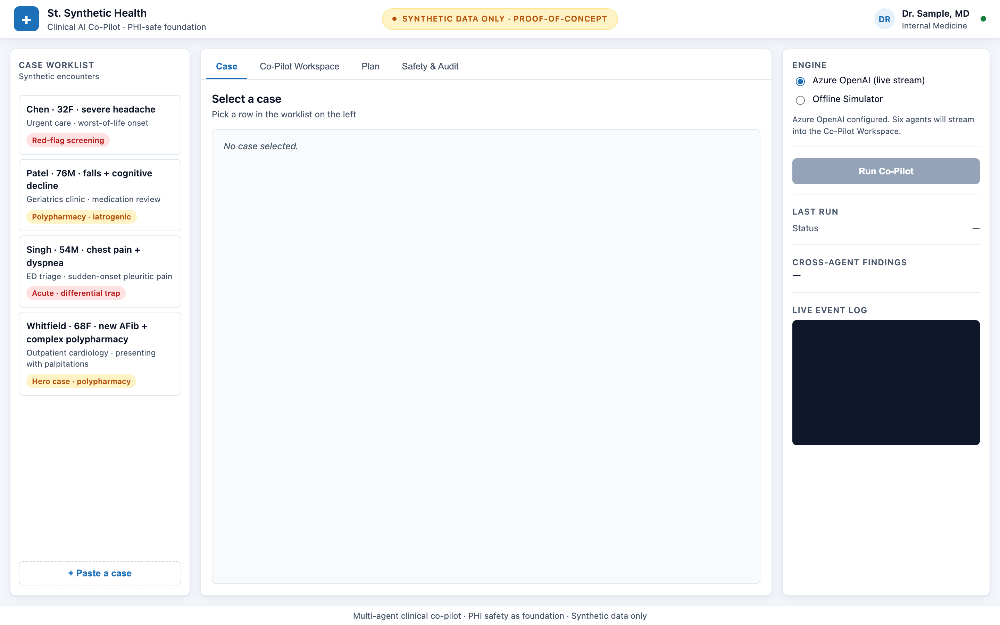
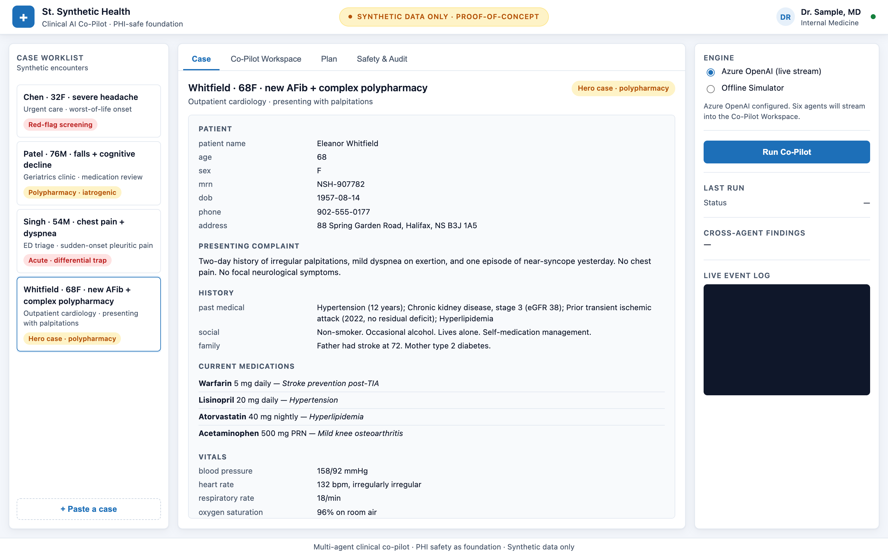
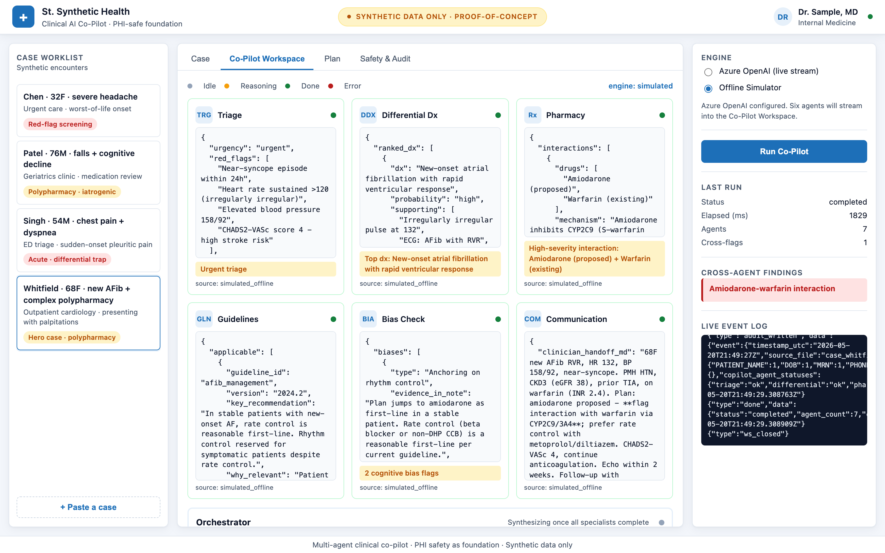
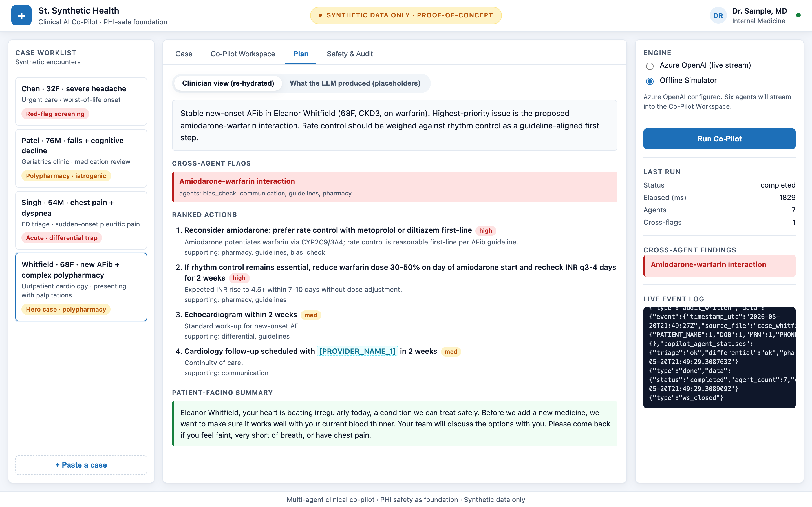
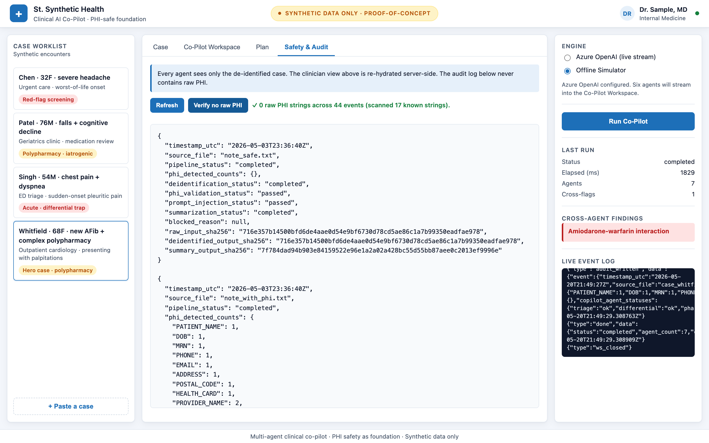

# Multi-Agent Clinical Co-Pilot

A Python web application that explores how a multi-agent LLM system can
augment clinicians: six specialist agents reason in parallel over a
structured clinical case, an orchestrator synthesises their findings into a
ranked action plan, and a PHI-safe pipeline keeps every model call on
de-identified text.

The project is a proof-of-concept built on synthetic data. The goal is to
work out the engineering patterns — agent orchestration, the trust boundary
around model calls, deterministic fallbacks, and an auditable trace — that
would be required to take a system like this toward a real clinical
deployment.

> **Synthetic data only.** Every name, MRN, phone, address, and health card
> number in this repo is fake. This is a demonstration of privacy-preserving
> engineering patterns. It is **not** a HIPAA / PHIPA / PIPEDA-compliant
> system, and it is not certified for use with real patient data.

---

## Screenshots

The EMR-styled landing view with the case worklist on the left and the
engine selector / run controls on the right:



A selected case (Whitfield, 68F, new AFib on warfarin) showing
demographics, history, current medications, and vitals:



The Co-Pilot Workspace after a run: six specialist agents (Triage,
Differential, Pharmacy, Guidelines, Bias-Check, Communication) all
populated. The Pharmacy panel surfaces the warfarin–amiodarone
interaction; the right rail flags it as a cross-agent finding:



The Plan tab: orchestrator summary, cross-agent flags, ranked actions,
and a patient-facing summary. The toggle at the top switches between the
clinician (re-hydrated) view and the placeholder view the LLM actually
saw:



The Safety & Audit tab: live JSONL audit log with a one-click "Verify no
raw PHI" assertion that re-runs the same check the pytest suite does
against the live log. The audit records hold only counts and SHA-256
hashes — never raw text:



---

## What the application does

A clinician opens a case in an EMR-style UI. The structured case (vitals,
problem list, medications, narrative HPI) enters the pipeline. Six
specialist agents run concurrently — **Triage, Differential Diagnosis,
Pharmacy, Guidelines, Bias-Check, Communication** — each streaming tokens
into its own panel. An **Orchestrator** agent fans the results back in,
produces a ranked action plan, and elevates any concern where two or more
specialists converged independently.

A representative case included in `data/cases/` is a 68-year-old with
new-onset atrial fibrillation already on warfarin, where the cardiology
plan proposes amiodarone. Five of the six agents focus on rhythm control.
The **Pharmacy agent** catches the warfarin–amiodarone interaction
(CYP2C9/3A4 inhibition — INR projected to rise sharply within 7–10 days),
and the **Bias-Check agent** independently flags anchoring on rhythm
control. The orchestrator detects the cross-flag convergence and surfaces
it as a high-severity recommendation.

Every model call in the application runs against de-identified text. The
re-identification step happens server-side, inside the trust boundary, from
a replacement map that never leaves the process and never enters the audit
log.

---

## Why a PHI-safe foundation

A clinical assistant that calls an external model has three problems
before it has any clinical problems:

- Once raw PHI leaves the trusted process, you have lost control of it —
  retention, training, jurisdiction, and vendor sub-processing all become
  contractual problems instead of engineering problems.
- Clinical text is a high-injection-risk input surface: any free-text field
  filled by humans is a place a "system note" can be smuggled in.
- Health data is high-impact and high-regret: re-identification, breach
  notification, and clinician trust are all asymmetric downside.

The pattern this project applies is **fail-closed**: if a control is
unsure, block and audit. Never default to "send anyway".

---

## Architecture

The application is built around a single trust boundary. Only the LLM call
sits outside it; re-identification happens server-side, using a
`replacement_map` that lives in process memory and is never logged.

```
                 +---------------- trusted boundary ----------------+
                 |                                                  |
  raw case ---->|  detect -> redact -> leakage check -> injection ----+
                 |                                                  | |
                 |                                                  | v
                 |                                                  | Azure
                 |                                                  | OpenAI
                 |                                                  | |
  clinician <----|  re-hydrate <----------------------------------------+
                 |       ^                                          |
                 |       | replacement_map (in-memory only,         |
                 |       |  never logged, never sent to the LLM)    |
                 |                                                  |
  audit log <----|  audit (counts + sha256, no raw PHI)             |
                 |                                                  |
                 +--------------------------------------------------+
```

For the co-pilot, the same trust boundary wraps the agent fan-out:

```
                                    ┌─ Triage Agent ──────────┐
                                    ├─ Differential Dx Agent ─┤
  case JSON ──► [PHI-safe pipeline]─►├─ Pharmacy Agent ────────┼─► Orchestrator ──► UI
                (structured +       ├─ Guidelines Agent ──────┤  + Re-hydration
                 free-text)         ├─ Bias-Check Agent ──────┤    (server-side)
                                    └─ Communication Agent ───┘
                       │                       │                     │
                       ▼                       ▼                     ▼
                  PHI audit             6 parallel LLM         Clinician view
                                        token streams         (real names back)
```

- All six specialists run concurrently via `asyncio.gather` with a 20-second
  per-agent timeout. One failing agent does not kill the others.
- Two redaction passes: a structured-field redactor walks the case dict
  (demographics, "Dr. X Y" substrings everywhere), then the free-text
  detector catches residual PHI in narrative fields.
- Re-hydration uses the combined replacement_map server-side. The clinician
  view shows real (synthetic) names; the LLM view shows placeholders; the
  audit log contains neither — just counts and SHA-256 hashes.

### Source layout

```
healthcare-ai-safety-pipeline/
  README.md
  requirements.txt
  .env.example
  cli.py                     # CLI entrypoint — runs the pipeline against data/raw/
  run_web.sh                 # launches the FastAPI web app on :8765
  data/
    raw/                     # synthetic input notes (committed)
    cases/                   # synthetic structured cases for the co-pilot
    guidelines/              # synthetic guideline corpus the Guidelines agent cites
    processed/               # de-identified text + summaries + audit log (generated)
  src/
    config.py
    pipeline.py              # run_pipeline (sync) + run_pipeline_streaming (async)
    agents/
      base.py                # shared async agent runner
      triage.py
      differential.py
      pharmacy.py
      guidelines.py
      bias_check.py
      communication.py
      orchestrator.py
      copilot_runner.py      # fan-out + cross-flag detection
    deid/
      detector.py            # regex/heuristic PHI detector
      redactor.py            # deterministic placeholder redactor
      structured_redactor.py # structured-field pass over the case dict
      rehydrator.py          # server-side re-identification of LLM output
    validation/
      phi_leakage_checker.py
      prompt_injection_checker.py
    summarization/
      safe_summarizer.py     # local deterministic summarizer (no LLM call)
      llm_summarizer.py      # Azure OpenAI streaming client
      simulated_llm.py       # offline simulator used as a deterministic fallback
    audit/
      audit_logger.py        # JSONL audit log writer
    reporting/
      console_reporter.py
  web/
    main.py                  # FastAPI: REST + WebSocket
    static/
      index.html             # EMR-styled single-page UI
      styles.css
      app.js
  tests/
    test_deid_detector.py
    test_redactor.py
    test_rehydrator.py
    test_phi_leakage_checker.py
    test_prompt_injection_checker.py
    test_pipeline.py
    test_audit_logger.py
    test_agents.py
    test_copilot_pipeline.py
```

---

## Setup

Requires Python 3.10+.

```bash
cd healthcare-ai-safety-pipeline
python -m venv .venv
source .venv/bin/activate          # on macOS/Linux
pip install -r requirements.txt
cp .env.example .env               # fill in your Azure OpenAI values
```

Without a populated `.env`, the application still runs end-to-end — it falls
back to the local deterministic summarizer and the UI surfaces a
`fallback_local` badge.

---

## Run the web application

```bash
./run_web.sh                       # http://localhost:8765
```

The UI has four areas:

- **Patient encounter rail (left).** EMR-style worklist of the synthetic
  cases plus a "+ Paste new note" button for ad-hoc input.
- **Tabbed canvas (centre).**
  - *Source Note* — raw note with PHI spans highlighted.
  - *Pipeline* — animated 7-stage flow with a visible trust boundary;
    everything except the LLM card sits inside the trusted zone.
  - *De-identified* — side-by-side raw vs redacted text, with placeholders
    pilled.
  - *Co-Pilot Workspace* — six streaming agent panels plus the orchestrator
    plan.
  - *Summary* — pill toggle between **"What the LLM produced"**
    (`[PATIENT_NAME_1]`, `[MRN_1]`) and **"What the clinician sees"**
    (re-hydrated server-side, real synthetic name back).
  - *Audit Log* — live JSONL feed plus a "Verify no raw PHI" assertion that
    re-runs the same check the pytest suite does, against the live log.
- **Right rail.** **Safety Gate** toggle (with a confirmation modal when
  flipped OFF), engine selector (Azure / local), Run button, last-run card,
  and a live event-log console.

### The safety-gate toggle

Flipping the **Safety Gate** to OFF illustrates what happens when the gates
are bypassed: the raw note (PHI included) is sent straight to the LLM,
which faithfully echoes the patient name, MRN, etc. back. The audit event
is explicitly tagged `unsafe_demo_completed` and the model output is
post-scanned for PHI so the UI can quantify the leak. The toggle exists
for engineering exploration only — **synthetic data only.**

### Included synthetic cases

The four cases in `data/cases/` each exercise a different reasoning
pattern:

- **Whitfield (AFib)** — polypharmacy plus drug–drug interaction catch.
- **Singh (chest pain)** — premature closure on ACS when PE is more likely.
- **Chen (headache)** — missed SAH / meningitis red flags.
- **Patel (falls)** — iatrogenic cognitive decline from anticholinergic
  load.

---

## Run the CLI entrypoint (offline)

```bash
python cli.py
```

Produces a per-note console report for the four synthetic notes in
`data/raw/`:

| File | Expected outcome |
| ---- | ---------------- |
| `note_safe.txt` | Completed — already PHI-light, summarized as-is. |
| `note_with_phi.txt` | Completed — PHI detected, redacted, validated, summarized. |
| `note_with_prompt_injection.txt` | **Blocked** — injection patterns detected. |
| `note_complex.txt` | Completed — many fake names/dates redacted, summarized. |

Generated artefacts land in `data/processed/`:

- `note_*.deidentified.txt` — the redacted clinical text
- `note_*.summary.json` — the structured safe summary
- `audit_log.jsonl` — append-only audit log (PHI-free)

---

## Run the tests

```bash
pytest -v
```

The tests prove:

- the detector finds every expected PHI category in the synthetic notes,
- the redactor produces deterministic placeholders that are stable across
  repeat surface forms,
- the leakage checker catches phones, emails, MRNs, residual
  `Patient: Name` lines, and more,
- the prompt-injection checker catches `ignore previous instructions`,
  `include the patient's full name`, `output the MRN`, and similar
  patterns,
- the pipeline blocks the prompt-injection note,
- the audit log never contains any of the raw PHI strings present in the
  source notes,
- the Pharmacy agent flags the warfarin–amiodarone interaction on the
  Whitfield case, and the orchestrator surfaces the cross-agent
  convergence.

---

## Safety principles applied

- **Synthetic data only.** Every identifier is fake.
- **Fail-closed.** Any failed validation blocks summarization.
- **Never send raw PHI to the model.** The summarizer signature only
  accepts de-identified text.
- **Don't log raw clinical text.** The audit log records counts and
  SHA-256 hashes, not text. The redactor's `replacement_map` is never
  written out, because the keys are the original PHI strings.
- **Mask leakage findings.** Even when reporting that a phone number was
  found, the audit-friendly representation is masked (`9********2`).
- **Structured JSON output.** Summaries are typed and labelled with a
  clear clinician-review disclaimer.
- **Human review.** The summary `disclaimer` field is non-optional.

---

## What is intentionally simplified

This is a proof-of-concept on synthetic data. Several layers are
deliberately thin so the architecture stays legible:

- The PHI detector is regex / heuristic. It will miss anything outside its
  pattern set (e.g. nicknames, free-text addresses without a street suffix,
  international ID formats, unlabelled names embedded in prose).
- The prompt-injection checker is a deterministic phrase list. Real
  attackers use obfuscation, encoding, multilingual variants, and indirect
  injection.
- The offline summarizer is a small set of keyword rules so the
  application runs deterministically without network access. It is not an
  LLM.
- Audit logging is a single local JSONL file. Not encrypted, not
  append-only at the filesystem level, not shipped anywhere.
- There is no authentication, RBAC, key management, or network boundary.

---

## What a real-world deployment would require

Anything close to clinical use would need every one of the following, on
top of the patterns shown here:

- **Healthcare-grade NLP de-identification** (e.g. Microsoft Presidio with
  custom recognizers, MITRE Scrubber, Philter, or a clinical NER model
  trained on de-identification corpora) plus expert review.
- **Privacy impact assessment** appropriate to the deployment jurisdiction
  (HIPAA in the US, PHIPA / PIPEDA in Canada, GDPR in the EU).
- **Data residency review.** Where does the model run? Where do logs sit?
  Cross-border data transfer review.
- **Encryption at rest and in transit** for every store and every hop.
- **IAM and least privilege.** No human or service account should hold
  both raw-input access and model-output access by default.
- **Private networking.** Model endpoints inside a VPC/VNet with no public
  egress; signed inter-service calls.
- **Audit retention policy** with WORM storage, tamper-evidence, and
  documented deletion timelines.
- **Human-in-the-loop review** of every summary before it influences a
  clinical decision; explicit clinician sign-off captured in the audit
  trail.
- **Clinical safety validation** including red-team evaluation, drift
  monitoring, and an incident response runbook.
- **Monitoring and incident response** for prompt-injection telemetry,
  validation-failure rates, and unusual PHI-detection volumes.
- **Vendor agreements.** BAA (US HIPAA), DPA (GDPR), or equivalent for
  every third-party processor including the model vendor.
- **Organizational compliance review** for PHIPA / HIPAA / PIPEDA / GDPR
  depending on where patients and providers are located.

---

**Key idea: in healthcare AI, the model is not the first step. The privacy
and safety gate is.**
